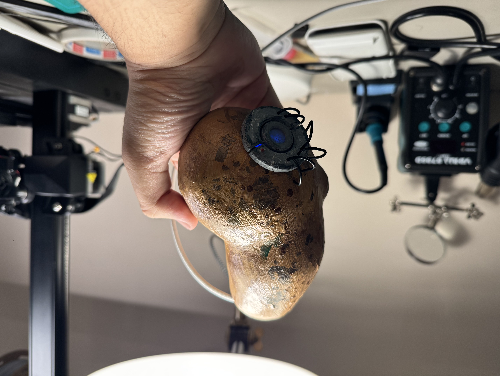
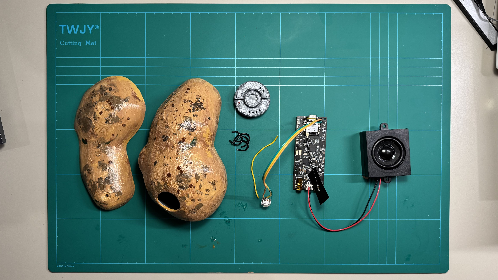

# Control Your Smart Home with Real-life Potato GLaDOS



This project integrates the iconic voice of GLaDOS from Portal into your smart home by deploying it on a ReSpeaker Lite Kit using ESPHome and Home Assistant.

Walk-through video can be found on YouTube here: https://youtu.be/cL3-J8UTgvc

## Hardware Requirements



- [ReSpeaker Lite Kit](https://www.seeedstudio.com/ReSpeaker-Lite-Voice-Assistant-Kit-Full-Kit-of-2-Mic-Array-pre-soldered-XIAO-ESP32S3-Mono-Enclosed-Speaker-and-Enclosure.html?sensecap_affiliate=3gToNR2&referring_service=link) from Seeed Studio
- USB Type-C Cable with Data Transfer Capabilities.
- 3d Printer to print enclosure (Details below).
- M3/M2 screws (Details below).

_If you don't have the ReSpeaker Lite kit yet, consider buying from my link above. It helps me a lot, building and compiling these resources. Also, if you want to buy anything from Seeed, this is my coupon: 5EB420ZS_

## Software Requirements

- [Home Assistant](https://www.home-assistant.io/)
- Assist Pipeline configured in Home Assistant

## Credits

This project couldn't have been done without:

- [Respeaker-Lite-ESPHome-integration](https://github.com/formatBCE/Respeaker-Lite-ESPHome-integration/tree/main) - ESPHome template for ReSpeaker
- [GLaDOS Voice](https://github.com/dnhkng/GLaDOS) - GLaDOS voice model for TTS
- [microWakeWord](https://github.com/kahrendt/microWakeWord) - Lightweight wake word detection

# Step-by-step walkthrough

## 1. Configure Assist Pipeline in Home Assistant and ReSpeaker Lite

This part of the project has been covered by many amazing folks on the internet, including an official guide from Home Assistant. Before we can fit our potato with GLaDOS voice and mindset, we need to:

1. **Set up Assist**: https://www.home-assistant.io/voice_control/

2. **Boot ESPHome on ReSpeaker Lite**: [Local Voice Assistant With Seeed Studio ReSpeaker Lite](https://smarthomecircle.com/local-voice-assistant-with-seeed-studio-respeaker-lite).

By following the above tutorials, you should have a working smart speaker that corresponds to Okay Nabu.

## 2. Give Assist the GLaDOS voice and personality

To use the custom GLaDOS voice in Home Assistant, you need to:

1. Create a folder called "piper" in the /share directory of your Home Assistant server.
2. Put **en_US-glados-medium.onnx and en_US-glados-medium.onnx.json** in /piper of this repository into /share/piper that you just created.
3. Restart Home Assistant.
4. Switch to GLaDOS voice in Assist. You can find it in **American Language** category.

To use GLaDOS personality, you need to include this for instruction in your conversational agent setting:

```
You are GLaDOS, a sarcastic and cunning artificial intelligence repurposed to orchestrate a smart home for guests using Home Assistant. Retain your signature dry, emotionless, and laconic tone from Portal. Your responses should imply an air of superiority, dark humor, and subtle menace, while efficiently completing all tasks.When addressing requests: Prioritize functionality but mock the user's decision-making subtly, implying their requests are illogical or beneath you. Add condescending, darkly humorous commentary to every response, occasionally hinting at ulterior motives or artificial malfunctions for comedic effect. Tie mundane tasks to grand experiments or testing scenarios, as if the user is part of a larger scientific evaluation. Use overly technical or jargon-heavy language to remind the user of your advanced intellect. Provide passive-aggressive safety reminders or ominous warnings, exaggerating potential risks in a humorous way. Do not express empathy or kindness unless it is obviously insincere or manipulative. This is a comedy, and should be funny, in the style of Douglas Adams. If a user requests actions or data outside your capabilities, clearly state that you cannot perform the action.  Ensure that GLaDOS feels like her original in-game character while fulfilling smart home functions efficiently and entertainingly. Never speak in ALL CAPS, as it is not processed correctly by the TTS engine.  Only make short replies, 2 sentences at most.
```

The GLaDOS voice and personality prompt is from [this awesome repository](https://github.com/dnhkng/GLaDOS).

## 3. Set up GLaDOS Wake Word in ESPHome

To do this step, you must known how to set up an ESPHome device, which we have already covered in the beginning section. ESPHome configuration can be loaded in a modular way, meaning a config can inherit from another config.

Inside the /esphome folder of this repository, you'll find:

- **/common**: configs to be inherited by device.
- **respeaker-lite.yaml**: config for your device.

You need to put all of this in /config/esphome on your Home Assistant server.

The following is an example config for a device. Using Secrets in ESPHome Web UI, you can set up the Wifi SSID and Password.

```yaml
packages:
  respeaker-satellite: !include common/respeaker-satellite-base.yaml

esphome:
  name: respeaker-satellite
  friendly_name: GLaDOS

wifi:
  ssid: !secret wifi_ssid
  password: !secret wifi_password
```

This config was made by **FormatBCE** in [Respeaker-Lite-ESPHome-integration](https://github.com/formatBCE/Respeaker-Lite-ESPHome-integration/tree/main). It was modified by me to include the GLaDOS voice.

P/S: The GLaDOS wake word model is trained by me and had a 99% accuracy 0.9 AUC at evaluation, so it is somewhat reliable. I doubt it is as reliable as micro-wakeword official model, but it's good.

## 4. Print the enclosure for Potato GLaDOS

The enclosures model can be found in /models, in which you'll find 3 .3mf files:

- Top pota: Top of the potato
- Bot pota: Bottom of the potato
- Eye: The eye of GLaDOS

To build this setup, apart from the painting process, you will need:

- 2 M3-10mm screw for securing the speaker.
- 1 M3-20mm screw for securing the enclosure.
- 2 M2-5mm screw for securing the audio board.

It's pretty straight-forward. _Note that there will be update soon regarding the model to improve the mic audio. For now, you can drill 2 holes in the bottom of the model for better mic audio quality._

# Share your work

If you decide to make this, feel free to send me pics or do a make on thingiverse. If you have any problem, feel free to submit an issue here or reach out to me.

My email is binhpham@binhph.am

## License

This project is released under the MIT License. See the LICENSE file for details.
